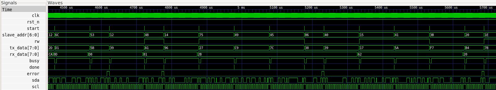

# I²C SV Core Implementation

## 1. Overview

This document describes the implementation details of the I²C SV Core.

It complements the project specification and architecture documents by documenting the RTL organization, coding style, implementation decisions, design trade-offs, synthesis results, and timing analysis throughout the development of the project.

---

## 2. Coding Guidelines

The I²C SV Core follows the implementation guidelines below:

- SystemVerilog is used throughout the project.
- Only synthesizable RTL constructs are used.
- Sequential logic is implemented using `always_ff`.
- Combinational logic is implemented using `always_comb`.
- Non-blocking assignments (`<=`) are used for sequential logic.
- Blocking assignments (`=`) are used for combinational logic.
- Enumerated types are used for finite-state machines where applicable.
- Parameters are validated during elaboration whenever possible.
- The design operates entirely within a single clock domain.
- Clock-enable signals are preferred over internally generated clocks where applicable.
- The design is fully parameterized wherever practical.

---

## 3. I²C Master

### 3.1 Module Overview

The `i2c_master` module implements a synthesizable, parameterized I²C Master supporting single-byte read and write transactions over a standard two-wire open-drain bus.

The design supports 7-bit slave addressing, START and STOP condition generation, ACK/NACK handling, repeated START transactions, and slave clock stretching. A programmable clock divider generates the I²C serial clock from the system clock using a four-phase timing scheme to coordinate protocol operations.

The implementation follows a synchronous single-clock architecture. All sequential logic operates on the rising edge of the system clock, while protocol timing is controlled through internally generated phase transitions. Transaction parameters are latched at the beginning of each transfer and remain unchanged until the transaction completes.

The module is fully synthesizable and vendor-independent, making it suitable for both FPGA and ASIC implementation flows.

### 3.2 Interface

#### Parameters

| Parameter | Description |
|-----------|-------------|
| `DATA_WIDTH` | Width of each data transfer. |
| `CLOCK_FREQ_HZ` | System clock frequency. |
| `SCL_FREQ_HZ` | Desired I²C bus clock frequency. |

#### Inputs

| Signal | Width | Description |
|--------|------:|-------------|
| `clk` | 1 | System clock |
| `rst_n` | 1 | Active-low synchronous reset |
| `start` | 1 | Initiates a transaction |
| `slave_addr` | 7 | Target slave address |
| `rw` | 1 | Read/Write control |
| `tx_data` | `DATA_WIDTH` | Data transmitted during write operations |

#### Outputs

| Signal | Width | Description |
|--------|------:|-------------|
| `rx_data` | `DATA_WIDTH` | Received data |
| `busy` | 1 | Indicates an active transaction |
| `done` | 1 | Transaction complete pulse |
| `error` | 1 | Indicates protocol failure |

#### Bidirectional Signals

| Signal | Description |
|--------|-------------|
| `sda` | Open-drain serial data line |
| `scl` | Open-drain serial clock line |

### 3.3 Derived Parameters

The I²C Master derives internal parameters from the user configuration to simplify counter sizing while maintaining parameterized scalability.

| Parameter | Purpose |
|-----------|---------|
| `DIVISOR` | Number of system clock cycles per quarter SCL period |
| `DIV_WIDTH` | Width of the clock-divider counter |
| `BIT_CNT_WIDTH` | Width of the transfer bit counter |

The implementation validates the following parameter constraints during simulation:

- `DATA_WIDTH > 0`
- `CLOCK_FREQ_HZ > 0`
- `SCL_FREQ_HZ > 0`
- `DIVISOR > 1`

Parameter validation is excluded from synthesis using `translate_off` directives while remaining active during simulation.

### 3.4 Internal Registers

The I²C Master maintains internal registers for transaction configuration, protocol timing, datapath operation, control, and registered outputs.

| Register | Purpose |
|----------|---------|
| `state` | Current transaction state |
| `phase` | Current SCL timing phase |
| `divider_reg` | Clock-divider counter |
| `clock_enable` | Enables SCL generation |
| `slave_addr_reg` | Latched slave address |
| `rw_reg` | Latched read/write control |
| `tx_data_reg` | Latched transmit data |
| `tx_shift_reg` | Serial transmit shift register |
| `rx_shift_reg` | Serial receive shift register |
| `rx_data_reg` | Registered received data |
| `bit_count` | Tracks transferred bits |
| `repeated_start_reg` | Stores repeated START request |
| `sda_drive_low` | Open-drain SDA control |
| `scl_drive_low` | Open-drain SCL control |
| `busy_reg` | Registered busy status |
| `done_reg` | Registered transaction complete indication |
| `error_reg` | Registered protocol error indication |

### 3.5 Combinational Signals

The I²C Master derives several combinational signals to simplify protocol implementation and reduce duplicated logic.

| Signal | Purpose |
|---------|---------|
| `quarter_tick` | Indicates completion of one quarter SCL period |
| `transfer_finish` | Indicates the final data bit of the current transfer |
| `last_bit` | Indicates the final bit before ACK/NACK processing |
| `sda_in` | Sampled SDA bus input |
| `scl_in` | Sampled SCL bus input |

These signals simplify transaction sequencing by separating protocol event detection from sequential state updates.

### 3.6 Datapath & State Machine

The I²C Master datapath consists of:

- Clock divider
- Four-phase clock generator
- Transaction FSM
- Transmit shift register
- Receive shift register
- Bit counter
- Open-drain bus interface
- Registered outputs

The I²C Master uses a seven-state finite-state machine.

| State | Function |
|--------|----------|
| `IDLE` | Waits for a transaction request |
| `START` | Generates the START condition |
| `ADDRESS` | Transmits the slave address and R/W bit |
| `ADDRESS_ACK` | Samples the slave acknowledge |
| `DATA_TRANSFER` | Transfers one data byte |
| `DATA_TRANSFER_ACK` | Processes the acknowledge phase |
| `STOP` | Generates the STOP condition and returns to `IDLE` |

### 3.7 Algorithm

1. Validate configuration parameters.
2. Wait for a valid `start` request.
3. Latch the transaction parameters.
4. Generate the START condition.
5. Transmit the slave address and read/write bit.
6. Process the address ACK/NACK response.
7. Perform the data transfer.
8. Process the data ACK/NACK response.
9. Generate a repeated START or STOP condition.
10. Store received data and report transaction status.

### 3.8 Design Decisions

- Single clock domain.
- Four-phase SCL timing generation.
- Clock-enable based protocol timing.
- Separate protocol controller and datapath.
- Independent transmit and receive shift registers.
- Dedicated open-drain SDA/SCL bus interface.
- Registered interface outputs.
- Repeated START support.
- Slave clock stretching support.
- Compile-time parameter validation.

### 3.9 Corner Cases

| Condition | Behaviour |
|-----------|-----------|
| Invalid parameters | Simulation-time parameter validation failure |
| `start` asserted while busy | Request ignored |
| Address NACK | Transaction terminates with `error` asserted |
| Data NACK | Transaction terminates with `error` asserted |
| Clock stretching | Master pauses until SCL is released |
| Repeated START | New transaction begins without issuing STOP |
| Reset | Controller returns to `IDLE` and clears internal registers |

### 3.10 Resource Utilization

#### Synthesis Results

- Tool: Yosys
- Script: `scripts/synth_i2c_master.ys`

#### Generic Synthesis Summary

| Metric | Value |
|--------|------:|
| Number of Ports | 12 |
| Number of Port Bits | 32 |
| Number of Wires | 335 |
| Number of Wire Bits | 1018 |
| Public Wires | 48 |
| Public Wire Bits | 150 |
| Memory Blocks | 0 |
| Memory Bits | 0 |
| Processes | 0 |
| Total Cells | 815 |

#### Cell Breakdown

| Cell Type | Count |
|-----------|------:|
| `$_AND_` | 173 |
| `$_MUX_` | 320 |
| `$_NOT_` | 37 |
| `$_OR_` | 199 |
| `$_SDFFE_PN0N_` | 3 |
| `$_SDFFE_PN0P_` | 74 |
| `$_SDFF_PN0_` | 1 |
| `$_XOR_` | 8 |

#### Waveform

#### Verification Status

- [x] RTL Simulation
- [x] Self-checking Testbench
- [x] Assertions
- [x] Generic Synthesis
- [ ] Static Timing Analysis

---

## 4. I²C Slave

### 4.1 Module Overview

The `i2c_slave` module implements a synthesizable, parameterized I²C Slave supporting single-byte read and write transactions over a standard two-wire open-drain bus.

The design supports 7-bit slave addressing, START and STOP detection, ACK/NACK handling, repeated START handling, and configurable clock stretching. SDA and SCL are synchronized to the system clock before protocol events are detected.

The implementation follows a synchronous single-clock architecture. The Slave does not generate the I²C clock; instead, it observes the bus clock generated by the Master and responds to synchronized SCL edges.

### 4.2 Interface

#### Parameters

| Parameter | Description |
|-----------|-------------|
| `DATA_WIDTH` | Width of each data transfer. |
| `SLAVE_ADDR` | Fixed 7-bit address of the Slave. |
| `STRETCH_CYCLES` | Number of system-clock cycles for an optional clock-stretch period. |

#### Inputs

| Signal | Width | Description |
|--------|------:|-------------|
| `clk` | 1 | System clock |
| `rst_n` | 1 | Active-low synchronous reset |
| `tx_data` | `DATA_WIDTH` | Data transmitted by the Slave during read transactions |

#### Outputs

| Signal | Width | Description |
|--------|------:|-------------|
| `rx_data` | `DATA_WIDTH` | Data received from the Master |
| `busy` | 1 | Indicates an active transaction |
| `done` | 1 | Transaction complete pulse |
| `error` | 1 | Transaction error indication |

#### Bidirectional Signals

| Signal | Description |
|--------|-------------|
| `sda` | Open-drain serial data line |
| `scl` | Open-drain serial clock line |

### 4.3 Derived Parameters

The I²C Slave derives internal parameters for the transfer and clock-stretch counters.

| Parameter | Purpose |
|-----------|---------|
| `BIT_CNT_WIDTH` | Width of the transfer bit counter |
| `STRETCH_CNT_WIDTH` | Width of the clock-stretch counter |

The implementation validates the following parameter constraints during simulation:

- `DATA_WIDTH > 0`
- `STRETCH_CYCLES >= 0`

Parameter validation is excluded from synthesis using `translate_off` directives while remaining active during simulation.

### 4.4 Internal Registers

The I²C Slave maintains registers for transaction direction, address reception, data movement, bus synchronization, clock stretching, control, and status outputs.

| Register | Purpose |
|----------|---------|
| `rw_reg` | Stores the received R/W direction |
| `tx_data_reg` | Stores the data to transmit |
| `tx_shift_reg` | Serial transmit shift register |
| `rx_shift_reg` | Serial receive shift register |
| `rx_data_reg` | Stores received data |
| `address_shift_reg` | Stores the received 7-bit address and R/W bit |
| `bit_count` | Tracks transferred bits |
| `stretch_count` | Tracks the configured clock-stretch interval |
| `sda_sync1` | First-stage SDA synchronizer |
| `sda_in` | Synchronized SDA input |
| `scl_sync1` | First-stage SCL synchronizer |
| `scl_in` | Synchronized SCL input |
| `stretch_request` | Requests a clock-stretch interval |
| `sda_drive_low` | Open-drain SDA control |
| `scl_drive_low` | Open-drain SCL control |
| `busy_reg` | Registered busy status |
| `done_reg` | Registered transaction-complete indication |
| `error_reg` | Registered protocol error indication |

### 4.5 Combinational Signals

The I²C Slave derives several combinational signals to detect bus events and control transaction sequencing.

| Signal | Purpose |
|---------|---------|
| `scl_rising` | Detects a synchronized SCL rising edge |
| `scl_falling` | Detects a synchronized SCL falling edge |
| `start_detected` | Detects a START condition |
| `stop_detected` | Detects a STOP condition |
| `transfer_finish` | Indicates the final data bit of the current transfer |

### 4.6 Datapath & State Machine

The I²C Slave datapath consists of:

- SDA/SCL synchronizers
- START/STOP and SCL edge detection
- Transaction FSM
- Address shift register
- Transmit shift register
- Receive shift register
- Bit counter
- Clock-stretch controller
- Open-drain bus interface
- Registered outputs

The I²C Slave uses a six-state finite-state machine.

| State | Function |
|--------|----------|
| `IDLE` | Waits for a START condition |
| `ADDRESS` | Receives the 7-bit slave address and R/W bit |
| `ADDRESS_ACK` | Generates the address ACK when the configured address matches |
| `DATA_TRANSFER` | Receives or transmits one data byte |
| `DATA_TRANSFER_ACK` | Generates or samples the data ACK/NACK |
| `STOP` | Completes the transaction and returns to `IDLE` |

### 4.7 Algorithm

1. Synchronize SDA and SCL to the system clock.
2. Detect the START condition.
3. Receive the 7-bit slave address and R/W bit.
4. Compare the received address with `SLAVE_ADDR`.
5. Generate an ACK when the address matches.
6. Perform a single-byte read or write transfer.
7. Generate or process the data ACK/NACK.
8. Apply clock stretching when configured.
9. Detect STOP or Repeated START.
10. Update received data and transaction status.

### 4.8 Design Decisions

- Single clock domain.
- Two-stage SDA/SCL synchronization.
- Separate protocol controller and datapath.
- Dedicated 8-bit address shift register.
- Independent transmit and receive shift registers.
- Open-drain SDA and SCL implementation.
- Registered interface outputs.
- Parameterized transfer width.
- Fixed parameterized slave address.
- Configurable clock stretching.
- Common `DATA_TRANSFER` and `DATA_TRANSFER_ACK` states for read and write directions.

### 4.9 Corner Cases

| Condition | Behaviour |
|-----------|-----------|
| Invalid parameters | Simulation-time parameter validation failure |
| Address mismatch | Slave does not acknowledge the address |
| STOP during transaction | Transaction terminates and the bus interface is released |
| Repeated START | Current transaction is abandoned and a new address phase begins |
| Clock stretching | Slave holds SCL low for the configured interval |
| Master NACK after read | Current read transfer terminates |
| Reset | Controller, counters, bus controls, and status outputs return to default values |

### 4.10 Resource Utilization

#### Synthesis Results

- Tool: Yosys
- Script: `scripts/synth_i2c_slave.ys`

#### Generic Synthesis Summary

| Metric | Value |
|--------|------:|
| Number of Ports | 9 |
| Number of Port Bits | 23 |
| Number of Wires | 297 |
| Number of Wire Bits | 832 |
| Public Wires | 44 |
| Public Wire Bits | 124 |
| Memory Blocks | 0 |
| Memory Bits | 0 |
| Processes | 0 |
| Total Cells | 688 |

#### Cell Breakdown

| Cell Type | Count |
|-----------|------:|
| `$_AND_` | 143 |
| `$_MUX_` | 280 |
| `$_NOT_` | 30 |
| `$_OR_` | 177 |
| `$_SDFFE_PN0P_` | 50 |
| `$_SDFF_PN0_` | 1 |
| `$_SDFF_PN1_` | 4 |
| `$_XOR_` | 3 |

#### Waveform

#### Verification Status

- [x] RTL Simulation Testbench
- [x] Self-checking Verification Environment
- [x] Assertions
- [x] Generic Synthesis
- [ ] Static Timing Analysis

---

## 5. I²C Top-Level

### 5.1 Module Overview

*To be completed after implementation.*

### 5.2 Interface

*To be completed after implementation.*

### 5.3 Internal Signals

*To be completed after implementation.*

### 5.4 Datapath & Hierarchy

*To be completed after implementation.*

### 5.5 Algorithm

*To be completed after implementation.*

### 5.6 Design Decisions

*To be completed after implementation.*

### 5.7 Corner Cases

*To be completed after implementation.*

### 5.8 Resource Utilization

*To be completed after synthesis and timing analysis.*

---

## 6. Technology Mapped Synthesis

*To be completed after Sky130 technology mapping.*

---

## 7. Static Timing Analysis

*To be completed after OpenSTA timing analysis.*

---

## 8. Summary

Version 1.0 of the I²C SV Core currently includes synthesizable and parameterized I²C Master and Slave modules.

The implemented I²C Slave supports:

- 7-bit slave addressing
- Single-byte read transactions
- Single-byte write transactions
- ACK/NACK handling
- START and STOP detection
- Repeated START handling
- Open-drain SDA/SCL interface
- Configurable clock stretching
- Self-checking verification environment
- Immediate SystemVerilog assertions

Generic synthesis and static timing analysis for the I²C Slave remain pending. The top-level integration module remains to be implemented.

---

# 9. Future Improvements

Future versions of the I²C SV Core may include:

- 10-bit addressing
- Fast Mode (400 kHz)
- Fast Mode Plus
- High-Speed Mode
- Multi-master arbitration
- Multi-byte transfers
- General Call addressing
- SMBus compatibility
- DMA support
- Interrupt generation
- APB wrapper
- AXI4-Lite wrapper
- Formal verification